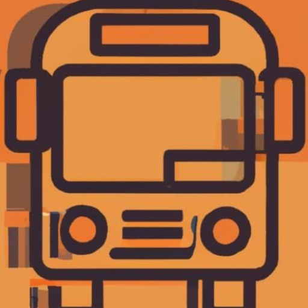
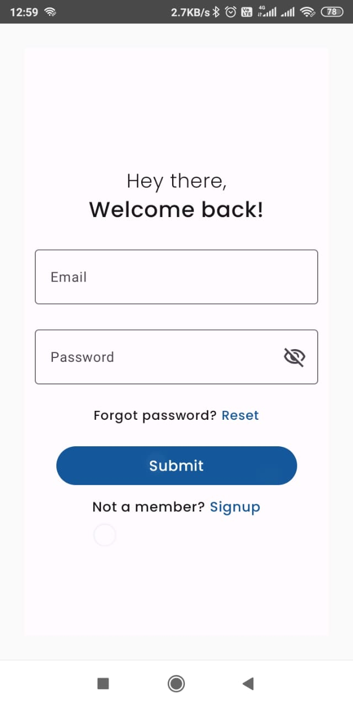
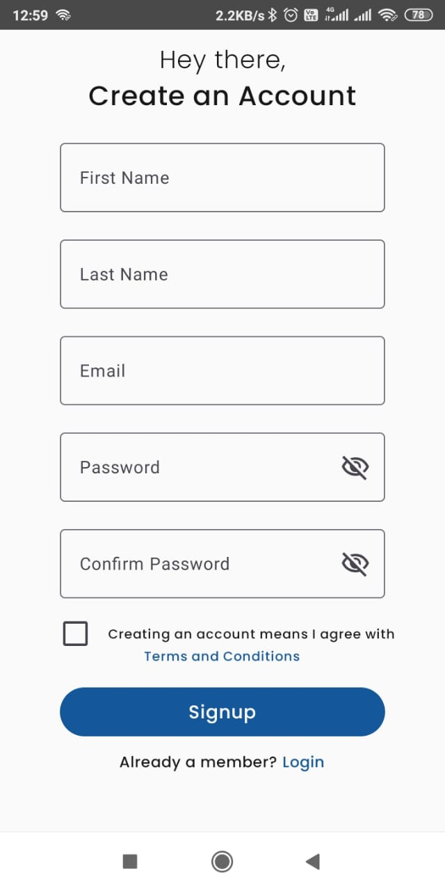
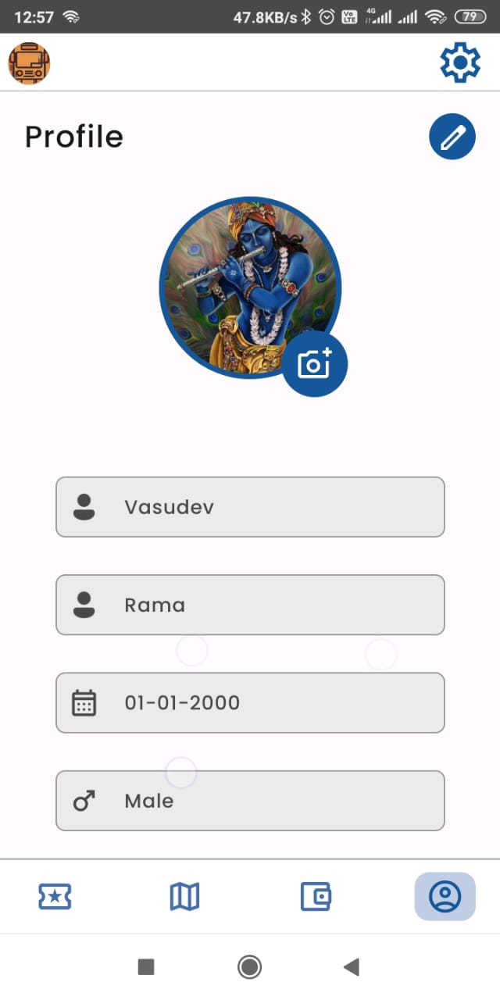
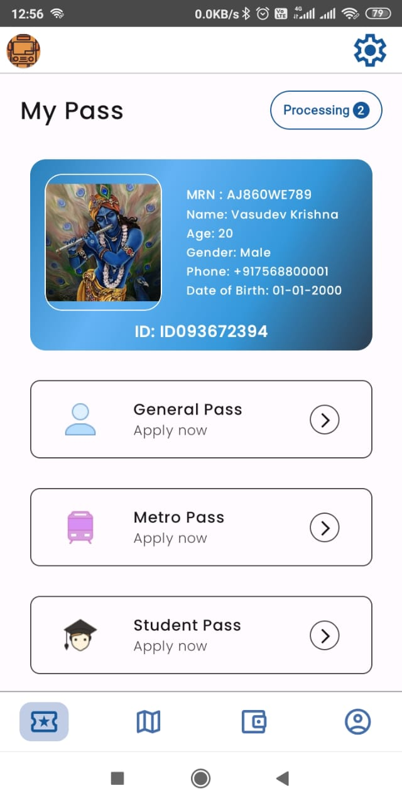
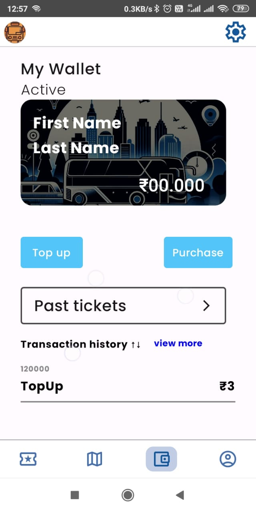
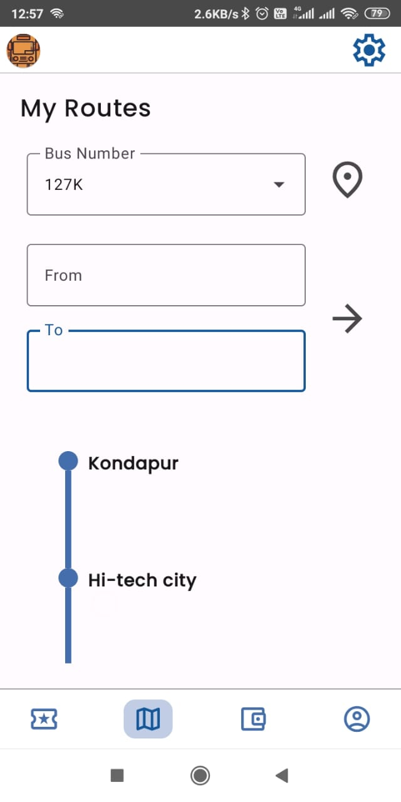

  
  <h1>Urban Access</h1>
  
Your one-stop solution for seamless urban transportation passes

  
  
  

## 📱 About

  
  Urban Access is a modern Android application that revolutionizes how users manage and acquire their transportation passes. Built with Material Design 3 principles and a focus on user experience, it provides a seamless interface for purchasing and managing various types of transit passes.

  Download the app now and experience the future of urban transit management!

## 🚀 Features

- **Multi-Pass Support**
  - General Bus Pass Application
  - Metro Pass Integration
  - Digital Pass Storage

- **Secure Authentication**
  - Email/Password Login
  - Password Recovery
  - Profile Management

- **Digital Wallet**
  - Integrated Payment System
  - Transaction History
  - Balance Management

- **Real-time Navigation**
  - Interactive Maps
  - Route Planning
  - Location Services

- **User-Friendly Interface**
  - Material Design 3
  - Dark/Light Theme Support
  - Responsive Layout

## 📸 Screenshots

  
    
  

  
  
  

## 🛠️ Built With

### Languages & Tools
- Kotlin
- Jetpack Compose
- Material Design 3
- Android Studio

### Architecture & Patterns
- MVVM Architecture
- Clean Architecture
- Repository Pattern
- Dependency Injection (Hilt)

### Libraries & SDKs
- Firebase Authentication
- Firebase Firestore
- Firebase Storage
- Google Maps SDK
- Dagger Hilt
- Coil
- Retrofit
- RazorPay Payment Gateway
- ZXing (QR Code)

### Testing
- JUnit
- Espresso
- Compose Testing